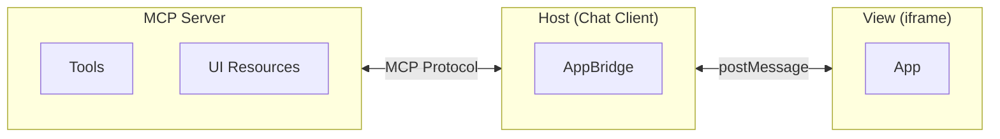

## What are MCP Apps?

MCP Apps is an extension to the Model Context Protocol that enables MCP servers to deliver interactive user interfaces to hosts. It defines how servers declare UI resources, how hosts render them securely in iframes, and how the two communicate.

MCP allows servers to expose tools and resources to AI assistants, but responses are limited to text and structured data. Many use cases need more:

- **Data visualization** — Charts, graphs, dashboards that update as data changes
- **Rich media** — Video players, audio waveforms, 3D models
- **Interactive forms** — Multi-step wizards, configuration panels, approval workflows
- **Real-time displays** — Live logs, progress indicators, streaming content

MCP Apps standardizes this. Servers declare their UIs once; any compliant host can render them.

## How do MCP Apps work?

Three entities work together:



- **Server** — A standard MCP server that declares tools and UI resources. Defines what the UI looks like (HTML) and what tools it exposes.
- **Host** — The chat client (e.g., Claude, ChatGPT) that connects to servers, embeds Views in iframes, and proxies communication between them.
- **View** — The UI running inside a sandboxed iframe. Receives tool data from the Host and can call server tools or send messages back to the chat.

## What happens if a host doesn't support MCP Apps?

MCP Apps is designed for graceful degradation. Hosts advertise their UI support when connecting to servers; servers check these capabilities before registering UI-enabled tools. If a host doesn't support MCP Apps, tools still work — they just return text instead of UI.

See [Capability Detection](/mcp-apps/server/capability-detection) for implementation details.

## How are MCP App UIs delivered?

UI resources are HTML templates that servers declare using the `ui://` URI scheme. Resources are declared upfront during [tool registration](/mcp-apps/server/register-app-tool), enabling:

- **Prefetching** — Hosts can cache templates before tool execution
- **Separation of concerns** — Templates (presentation) are separate from tool results (data)
- **Review** — Hosts can inspect UI templates during connection setup

## How are tools linked to UIs?

Tools reference their UI templates through [resource metadata](/mcp-apps/server/register-app-resource):

```json
"_meta": {
  "ui": { "resourceUri": "ui://weather/forecast" }
}
```

When a tool with UI metadata is called, the Host fetches the corresponding resource, renders it in a sandboxed iframe, and passes the tool arguments and results to the View.

## What can MCP Apps do at runtime?

Views communicate with Hosts using JSON-RPC over `postMessage`. From a View, you can:

- **[Call server tools](/mcp-apps/app/requests#callservertool)** — Fetch fresh data or trigger server-side actions
- **[Send messages](/mcp-apps/app/requests#sendmessage)** — Add messages to the conversation thread
- **[Update model context](/mcp-apps/app/requests#updatemodelcontext)** — Push structured data to the model's context
- **[Open links](/mcp-apps/app/requests#openlink)** — Request the host to open external URLs
- **[Download files](/mcp-apps/app/requests#downloadfile)** — Trigger host-mediated file downloads
- **[Request display modes](/mcp-apps/app/requests#requestdisplaymode)** — Switch between inline, fullscreen, and picture-in-picture

See the full [App lifecycle](/mcp-apps/lifecycle) and [Requests API](/mcp-apps/app/requests) for details.

## How does tool visibility work?

Tools can be visible to the model, the app, or both. By default, tools are visible to both (`visibility: ["model", "app"]`).

App-only tools (`visibility: ["app"]`) are useful for UI interactions that shouldn't clutter the agent's context — things like refresh buttons, pagination controls, or form submissions. The model never sees these tools; they exist purely for the View to call.

## What display modes are available?

Views can be displayed in different modes:

- **inline** — Embedded in the chat flow (charts, previews, forms)
- **fullscreen** — Takes over the window (editors, games, dashboards)
- **pip** — Picture-in-picture overlay (music player, timer)

Views declare which modes they support; Hosts declare which they can provide. The Host always has final say over its own UI.

## How are MCP Apps secured?

All Views run in sandboxed iframes with no access to the Host's DOM, cookies, or storage. Communication happens only through `postMessage`, making it auditable.

Servers declare which network domains their UI needs via [CSP metadata](/mcp-apps/server/register-app-resource#csp-reference). Hosts enforce these declarations — if no domains are declared, no external connections are allowed.
