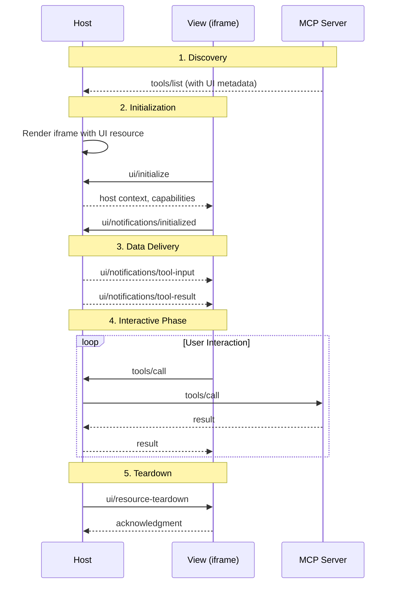

An MCP App goes through five stages: discovery, initialization, data delivery, interactive phase, and teardown. The host orchestrates this lifecycle — the [App class](/mcp-apps/app/app-class) handles most of it automatically via `connect()`.

## Sequence



## 1. Discovery

The Host learns about tools and their UI resources when connecting to the server. Tools with `_meta.ui.resourceUri` are identified as MCP App tools.

```ts
registerAppTool(server, "weather", {
  description: "Get weather forecast",
  _meta: { ui: { resourceUri: "ui://weather/view.html" } },
}, handler);
```

The Host reads the tool's `_meta.ui.resourceUri` to determine which resource to fetch and render.

## 2. Initialization

When a UI tool is called, the Host renders the iframe. The View sends `ui/initialize` with its app info and capabilities. The Host responds with:

- **Protocol version** — Negotiated protocol version
- **Host info** — Host name and version
- **Host capabilities** — What the host supports (tool proxying, messages, links, etc.)
- **Host context** — Theme, locale, display mode, container dimensions, safe area insets

The View then sends `ui/notifications/initialized` to signal readiness.

<Info>
The `App` class handles this handshake automatically in `connect()`. Register event handlers **before** calling `connect()` to avoid missing notifications.
</Info>

## 3. Data Delivery

The Host sends tool arguments and results to the View:

- **`ui/notifications/tool-input`** — Complete tool arguments after the tool call begins
- **`ui/notifications/tool-input-partial`** — Streaming partial arguments (healed JSON) for progressive rendering
- **`ui/notifications/tool-result`** — Tool execution result from the server, including both `content` (text for model context) and `structuredContent` (data optimized for UI rendering)
- **`ui/notifications/tool-cancelled`** — Notification that tool execution was cancelled

## 4. Interactive Phase

The user interacts with the View. The View can:

| Action | Method |
|--------|--------|
| Call server tools | [`callServerTool()`](/mcp-apps/app/requests#callservertool) |
| Send chat messages | [`sendMessage()`](/mcp-apps/app/requests#sendmessage) |
| Update model context | [`updateModelContext()`](/mcp-apps/app/requests#updatemodelcontext) |
| Open external links | [`openLink()`](/mcp-apps/app/requests#openlink) |
| Download files | [`downloadFile()`](/mcp-apps/app/requests#downloadfile) |
| Change display mode | [`requestDisplayMode()`](/mcp-apps/app/requests#requestdisplaymode) |
| Send logs | [`sendLog()`](/mcp-apps/app/requests#sendlog) |

The Host proxies tool calls to the MCP server and forwards responses back to the View.

## 5. Teardown

Before unmounting the iframe, the Host sends `ui/resource-teardown`. The View can save state or release resources before returning an acknowledgment. See [Event Handlers](/mcp-apps/app/event-handlers#onteardown) for handling teardown.

```ts
app.onteardown = async () => {
  await saveState();
  closeConnections();
  return {};
};
```

## Host Context Updates

At any point during the interactive phase, the Host may send `ui/notifications/host-context-changed` when the environment changes (theme toggle, resize, locale change). The `App` class automatically merges these updates into its internal context — access the latest via [`getHostContext()`](/mcp-apps/app/app-class#gethostcontext).
